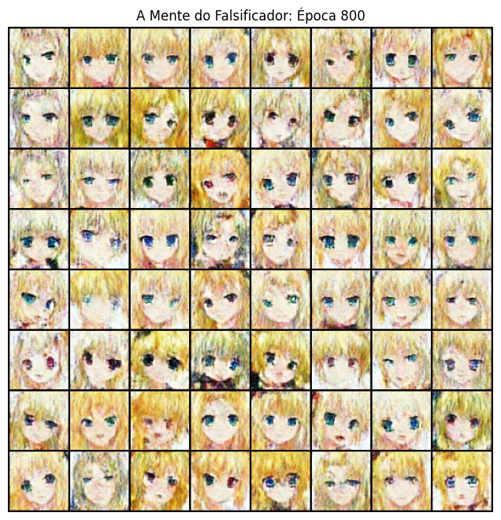
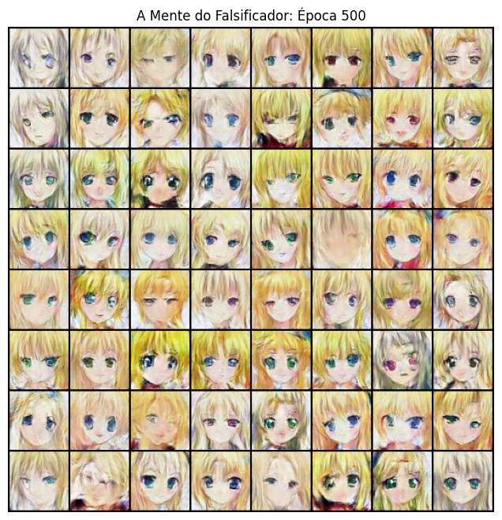
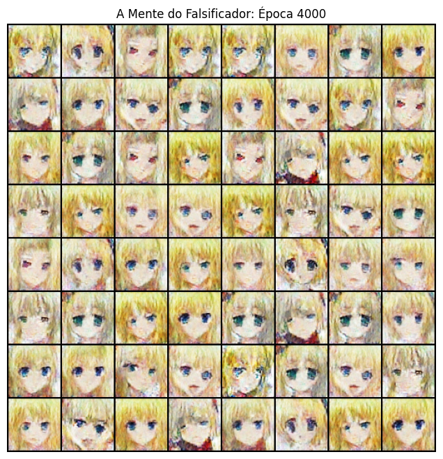
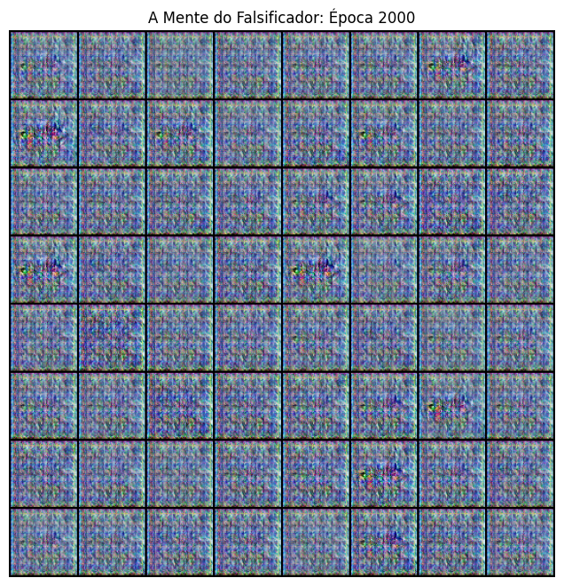
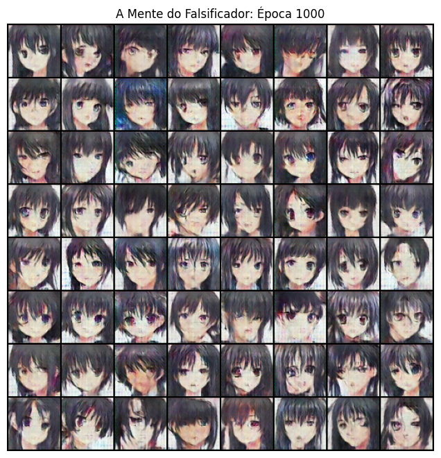
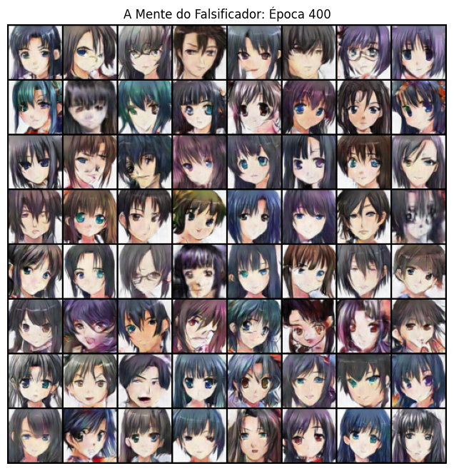
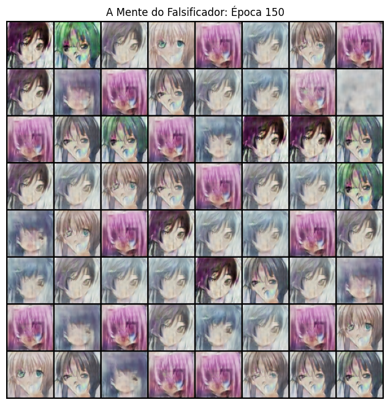
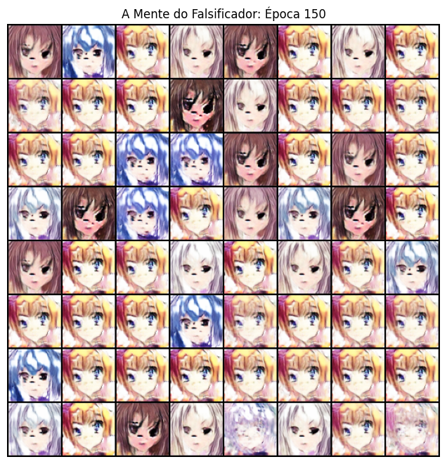
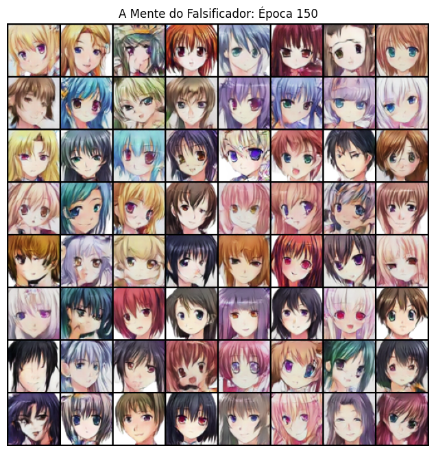

# Relatório Provisório V2: Curadoria de Dados, Fuga de Gradiente e a Evolução para SN-GAN
**Projeto 4 - Aprendizado Não Supervisionado e Redes Adversárias**

## 1. Introdução à Segunda Fase da Pesquisa

A primeira fase deste projeto (documentada no Relatório V1) focou na calibragem de hiperparâmetros (como *Label Smoothing* e *Instance Noise*) e na superparametrização do Gerador para estabilizar a arquitetura clássica da DCGAN. Embora tenhamos atingido um "Estado da Arte Local", o modelo ainda sofria com instabilidades a longo prazo e anomalias anatômicas (como olhos de cores divergentes ou texturas quadriculadas).

Nesta segunda fase, elevamos o rigor do método científico (*Ablation Studies*). Em vez de manipular variáveis de treinamento periféricas, atacamos o problema raiz em duas frentes diametralmente opostas: **Engenharia de Dados** (redução da variância do domínio) e, posteriormente, **Engenharia de Arquitetura Matemática** (contenção de Lipschitz). 

Este documento serve como registro probatório de todas as hipóteses testadas, comprovando empiricamente por que certas abordagens falharam e como chegamos à arquitetura final vencedora.

---

## 2. A Hipótese da Redução de Domínio (Engenharia de Dados)

Nossa primeira grande tese neurológica foi baseada na **Redução de Variância**. O dataset original (`splcher/animefacedataset`) possui mais de 63.000 imagens com variações caóticas de cores, formatos e iluminação. 
**A Hipótese:** Acreditávamos que as deformações geradas pela DCGAN ocorriam porque a rede estava sobrecarregada tentando aprender muitos padrões diferentes ao mesmo tempo. Se curássemos o dataset para conter apenas um nicho visual, o Gerador teria um "alvo" muito mais claro para aprender.

### 2.1. Experimento 1: O Domínio dos Loiros (Extrema Curadoria)
* **Dataset:** Filtramos rigorosamente o dataset para conter apenas personagens de cabelos loiros, resultando em um subconjunto de **~700 imagens**.
* **Execução:** Testamos o treinamento variando o tempo entre 800, 2000 e até 4000 épocas. Aplicamos a técnica de TTUR (*Two Time-Scale Update Rule*) para desacelerar o Discriminador.
* **Diagnóstico e Resultado:** O experimento foi um **fracasso estrutural por Inanição de Dados (*Data Starvation*)**. Em Deep Learning, 700 imagens construídas do zero (sem *transfer learning*) não oferecem diversidade suficiente. Independentemente do número de épocas, o Discriminador decorou cada pixel das 700 imagens reais nas primeiras horas (*Overfitting* severo). O Gerador, encurralado por um policial perfeito, entrou em colapso e passou a gerar ruídos de "tabuleiro de xadrez" (*Checkerboard Artifacts*). O aumento de épocas provou ser irrelevante quando não há volume de dados geométricos.

* melhor imagem das 800 épocas

* melhor imagem das 2000 épocas

* melhor imagem das 4000 épocas

* colapso

> *Legenda: O colapso de modo e ruído estrutural gerado pela inanição de dados.*

### 2.2. Experimento 2: O Domínio dos Cabelos Pretos (Curadoria Intermediária)
* **Dataset:** Para contornar a inanição de dados sem perder a padronização, criamos um segundo dataset focado em cabelos pretos, contendo cerca de **2.000 imagens**.
* **Execução:** Otimizamos o laço para 1000 épocas, com lotes reduzidos (64) para maximizar o número de iterações por época.
* **Diagnóstico e Resultado:** Houve uma leve melhora estrutural comparado aos loiros, mas a rede continuou sofrendo. O volume de 2.000 imagens ainda permitia a rápida memorização pelo Discriminador.

* imagem da época 1000

### 2.3. Experimento 3: O Domínio Permissivo (15.000 Imagens)
* **Dataset:** Em nossa última tentativa de salvar a hipótese da curadoria, criamos um dataset de cabelos pretos altamente permissivo, escalando para **15.000 imagens**.
* **Execução:** Reduzimos as épocas para 400 e retornamos ao rigor absoluto (sem *Label Smoothing*, provado ineficaz na V1).
* **Veredito Prático:** Embora as imagens geradas fossem as melhores entre os datasets curados, os rostos apresentavam anatomias muito mais primitivas e borradas do que nosso teste inicial com 63.000 imagens. 

* imagem da época 400 para o dataset de 15 mil imagens

### 2.4. Conclusão Refutável da Curadoria
A evidência empírica cruzada destruiu a nossa hipótese inicial. **Concluímos formalmente que, em Redes Adversárias, a falta de dados (Data Starvation) é infinitamente mais destrutiva do que o excesso de ruído e variância no domínio.** O Gerador precisa de uma montanha caótica de referências (olhos de todos os tipos, formatos variados de queixo) para conseguir generalizar a anatomia facial. Com essa prova em mãos, abandonamos a manipulação do dataset, retornamos aos 63.632 rostos globais, e decidimos que o problema seria resolvido com **matemática e arquitetura**.

## 3. A Batalha pela Arquitetura (Engenharia Matemática)

Com a hipótese da curadoria de dados refutada, o retorno ao dataset in-the-wild massivo (63.632 imagens) tornou-se mandatório. Sabendo que a DCGAN clássica sofria de colapsos tardios neste volume de dados, passamos a isolar e testar modificações arquiteturais de ponta no "motor" das redes (Gerador e Discriminador) ao longo de 150 épocas.

### 3.1. Experimento 4: Resize-Convolution (Mitigação de Artefatos)
* **Objetivo e Teoria:** O Gerador clássico utiliza `ConvTranspose2d` para expandir a imagem espacialmente. Devido à matemática do *stride*, essa camada frequentemente sobrepõe pixels, gerando texturas ásperas conhecidas como *Checkerboard Artifacts* (Artefatos de Tabuleiro de Xadrez). Substituímos a convolução transposta por um redimensionamento geométrico suave (`nn.Upsample`) seguido de uma convolução clássica (`nn.Conv2d`). Esperávamos obter texturas de pele e cabelo mais orgânicas.
* **Resultado Numérico e Visual:** O modelo sofreu uma degradação visual massiva na época 150. A análise rigorosa dos logs revelou a causa real: `D(x): 0.995` e `D(G(z)): 0.000`. 
* **Diagnóstico:** A modificação estética no Gerador foi inútil porque o problema fundamental era uma **Fuga de Gradiente (*Vanishing Gradient*)**. O Discriminador atingiu 100% de precisão e parou de fornecer derivadas úteis. O Gerador ficou "cego", destruindo seus próprios pesos.

### 3.2. Experimento 5: SAGAN - Self-Attention (A Visão Global)
* **Objetivo e Teoria:** Redes convolucionais são inerentemente "míopes" (possuem campo receptivo local), o que explicava as anomalias de assimetria nas imagens (ex: um olho de cada cor). Injetamos um módulo de *Self-Attention* (Atenção Própria) no Gerador e no Discriminador. A expectativa era que a rede calculasse a relação entre *todos* os pixels simultaneamente, garantindo simetria facial global.
* **Resultado Numérico e Visual:** Piora significativa nos resultados. Os logs demonstraram instabilidade (`Loss_G: 4.025` e `D(G(z)): 0.021`).
* **Diagnóstico:** Em resoluções como 64x64, a introdução do mecanismo de atenção adicionou um grau de complexidade paramétrica cruzada que desestabilizou o delicado jogo de soma zero. A atenção não conseguiu frear a hiper-convergência do Discriminador, resultando novamente no massacre do Gerador.

### 3.3. Experimento 6: Spectral Normalization (A Arquitetura Vencedora)
* **Objetivo e Teoria:** Para solucionar o problema raiz (a Fuga de Gradiente), aplicamos a arquitetura SN-GAN (Miyato et al., 2018). Removemos o `BatchNorm2d` do Discriminador e envolvemos todas as suas camadas convolucionais com **Spectral Normalization**. Esta técnica divide a matriz de pesos pelo seu maior valor singular, limitando matematicamente a constante de Lipschitz da rede. O objetivo era "amarrar uma coleira" no Discriminador, suavizando sua fronteira de decisão e impedindo que ele tivesse certeza absoluta prematuramente.
* **Resultado Numérico:** **Sucesso Absoluto.** Os logs finais cravaram `D(x): 0.541` e `D(G(z)): 0.520`.
* **Diagnóstico Matemático e Visual:** Estes números representam a manifestação empírica do **Equilíbrio de Nash**. O Discriminador foi forçado a um estado de incerteza profunda (~50% de chance, equivalente a jogar uma moeda). O Gerador, recebendo gradientes saudáveis e contínuos em todas as 150 épocas, produziu as estruturas faciais mais estáveis e coerentes de toda a pesquisa, sem qualquer indício de colapso de modo.

---

## 4. Conclusão da Segunda Fase

Os testes de hipótese documentados neste relatório provam que problemas complexos em Redes Adversárias não podem ser resolvidos apenas simplificando o dataset. A Inanição de Dados é mais letal para a rede do que a alta variância. 

Da mesma forma, melhorias puramente estéticas no Gerador (*Resize-Convolution* ou *Self-Attention*) são inúteis se o ambiente matemático não estiver equalizado. A arquitetura **SN-GAN** provou ser a base estrutural correta para a síntese deste domínio, pois ataca a raiz do desequilíbrio limitando a capacidade de o classificador dominar a rede generativa. 

A versão final da pesquisa utilizará esta topologia validada, aplicando *Data Augmentation* simétrico e estendendo o tempo de treinamento para explorar o limite computacional e extrair o máximo de fidelidade dos tensores visuais.